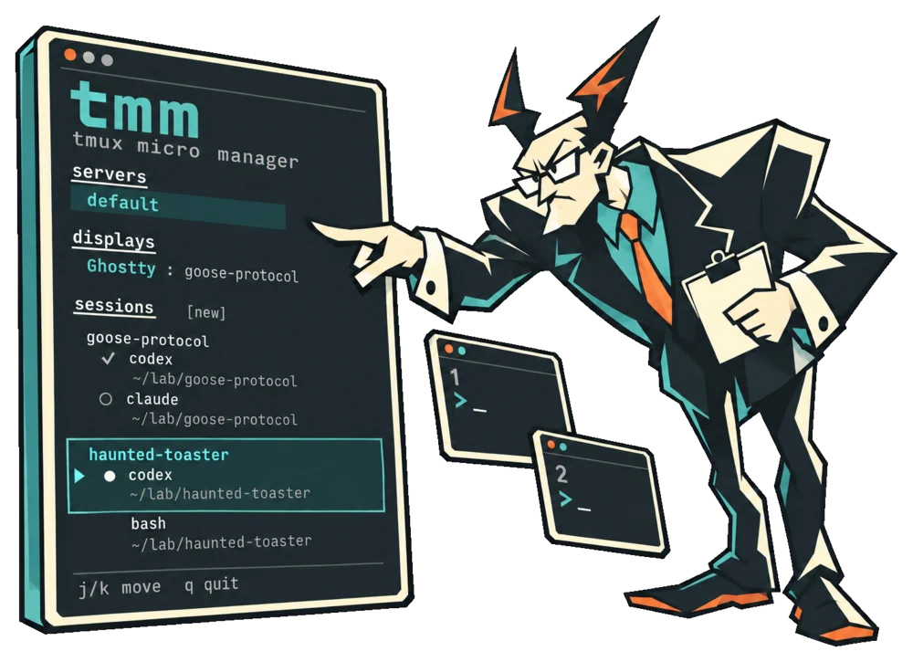

# tmm : tmux micro manager

<p align="center">
  
</p>

A skinny libvaxis sidebar for ordinary tmux sessions. Run it beside your workspace terminal. One scrolling list contains servers, displays, and sessions with every pane and its current directory.

## Build and run

Requires Zig 0.16.0 and tmux. Zig fetches [libtmux](https://github.com/awesomo4000/libtmux) and libvaxis from public repositories, with revisions and content hashes pinned in `build.zig.zon`. Tested with tmux 3.7c and libtmux revision `c63d5aa24d95c8bf757f8ad0b79f81da98275dbf`. No sibling checkout or JavaScript runtime is needed.

```sh
zig build
./zig-out/bin/tmm
```

The default launch lists the default server and discovers other running sockets in `$TMUX_TMPDIR/tmux-UID`, or `/tmp/tmux-UID`. Discovery happens at startup. Custom socket paths can be added explicitly:

```sh
./zig-out/bin/tmm -L work --server experiments
./zig-out/bin/tmm -S /tmp/work.sock --server-path /tmp/other.sock
```

`-L` or `-S` selects the initial server and disables automatic discovery, useful for isolated setups. Repeat `--server` or `--server-path` to add entries. Clicking a server clears the previous display target before loading its displays and sessions.

## Navigation

Hover highlights an item; click selects it. Wheel scrolling moves the list without activating anything. `j`/`k` or arrows move among actionable rows; Enter activates. `q` or Ctrl-C exits.

1. Pick a server.
2. Pick the display you want to control. Each display row shows `terminal app : session name`, for example `Ghostty : tmm coding`. Parent-process tracing finds the terminal app; matching names get a tty suffix for disambiguation, and unknown owners fall back to the tty. SSH connections are labeled SSH because the remote terminal app is not visible.
3. Click a pane to show its exact session, window, and pane. To switch a session without choosing a pane, highlight its name and press Enter.

Click a session name to rename it inline. The first text you type replaces the existing name. Enter saves, Escape cancels, and arrows, Backspace, and Ctrl-U edit the field. Renaming uses the stable session ID and does not switch displays. A duplicate or invalid name leaves the editor open for correction.

`--client` can preselect an attached tty at startup. `--label main-workspace` gives the selected display an invocation-local friendly label. Internal IDs and PIDs are not shown in the sidebar.

Click `blink` below the displays, or press `b`, to identify the selected display. Hovering a display and pressing `b` identifies that row instead. The chosen terminal shows a text marker steadily for five seconds; other terminals are unaffected. Terminal output continues updating and key presses do not dismiss the label early.

The active server, selected display, active session, and current pane use brighter text without inverse backgrounds. Entries use a subtle background for selection and hover, spanning the widest content in the column, clipped to the terminal width. Pane backgrounds cover both the name and directory. A `▸` at the left edge marks the selected display’s current pane; hover does not move that marker. Click `[new]` beside the sessions heading to enter a name, then Enter to create or Escape to cancel. Creation uses the selected display’s current pane directory, names the session and first window, and switches that display into the new session. Other displays stay where they are. Select a display before creating a session. Click either the pane name or its directory to focus that pane on the selected display. The current pane marker follows native tmux navigation too. Each pane's current directory is indented beneath its row, with the home directory abbreviated to `~`. It follows changes to that pane's working directory. Session paths are not displayed.

## Agents

Every pane appears under its session. Ordinary panes show their current command; agent panes show their agent name and status indicator. Codex and Claude status is inferred from known controls near the live bottom of the pane screen and from recognized terminal-title signals. Claude activity lines are recognized even when they omit the interrupt hint. The detector adapts selected rules from [Herdr](https://github.com/herdrdev/herdr/tree/b9ce96869e89937278d673d70ae4c135dd318469/src/detect/manifests); provenance and its Apache license are recorded in `THIRD_PARTY_NOTICES.md`.

| Symbol | Meaning |
| --- | --- |
| `●` | Working |
| `!` | Waiting for approval/input |
| `✓` | Completion awaiting acknowledgement |
| `○` | Idle, no outstanding completion |
| `?` | Present, status unknown |

Known working-to-idle transitions require two consecutive idle samples before producing a completion. A first observation of an already-idle process does not prove a completed turn. Explicit `@agent_state=done:<receipt>` can establish a completion immediately. A checkmark remains until clicking that agent successfully navigates to its pane. Acknowledgement applies to the exact receipt and process identity shown when clicked, so an older click cannot clear a newer completion. Outstanding completions remain visible when the pane starts another turn.

The controller also reads explicit `@agent_hint`, `@agent_state`, `@agent_session_id`, and `@agent_status_text`. Nonempty explicit state overrides screen classification. Without a hint it recognizes executable names for Codex, Claude, Aider, OpenCode, and Gemini through pane process ancestry. Automatic screen classification currently supports Codex and Claude only; other agents can report explicit states.

Screen detection is heuristic, not an agent protocol. Quiet output alone is never a completion. Unsupported, changed, or unreadable screens remain unknown. Transitions entirely between polls can be missed. Explicit metadata can outlive its writer. Receipt tracking is local to the current controller worker and resets on restart or server switch; it is not yet durable. Automatic acknowledgement from GUI focus is not implemented. `--dump` includes `status_source` and `status_rule` for inspection, but its one-shot collection does not include the running controller's unread history.

Pane navigation validates the pane's membership in the requested session and window before switching. tmux active windows and panes have ordinary shared semantics: other clients viewing the same session/window can observe those selections. Only the chosen client's attached session is switched.

## Inspection and tests

```sh
./zig-out/bin/tmm --help
./zig-out/bin/tmm -L work --dump
zig build test
python3 tests/integration.py
```

`--dump` emits a read-only JSON snapshot without opening the UI. Build before running integration tests. Tests use unique sockets and disposable files under `/tmp`, never the default server. They cover shell and agent pane navigation, client isolation, sidebar mouse input, blink, unusual names and paths, resizing, disconnection, switching servers, failures, and exit.

## Implementation and remaining work

`src/sidebar.zig` builds sidebar rows and discovers conventional server sockets. `src/main.zig` owns rendering and interaction. `src/backend.zig` polls tmux on a worker and handles navigation requests. `src/model.zig` handles length-prefixed records, client identity, and agent detection.

All requests stay within the selected server. Display identity includes tty/name, PID, and creation timestamp. Disconnects require explicit selection again. Failed refreshes retain the previous snapshot and display the tmux diagnostic.

Reads span several commands, and client revalidation is separate from mutations, so topology can change between them. libtmux does not yet expose command deadlines. Persistent display registration, focus hooks, durable completion storage, broader agent support, and event-driven refreshes remain follow-up work. No hooks or layout changes are installed.

## TODO

- [ ] Add an agent status reporting interface and hook integrations, starting with Claude and Codex where supported. Agents should report working, waiting for input or approval, turn completion, and exit, tied to the tmux pane and agent run identity. Prefer explicit hook events over screen inference; keep screen detection as a fallback. Handle stale events and agent restarts, preserve existing user hooks, and keep completion acknowledgement separate from reported status. Investigate available lifecycle hooks before choosing the transport or event format.

## License

This project is licensed under the [Mozilla Public License 2.0](LICENSE). Third-party attribution and license information are in [THIRD_PARTY_NOTICES.md](THIRD_PARTY_NOTICES.md).
